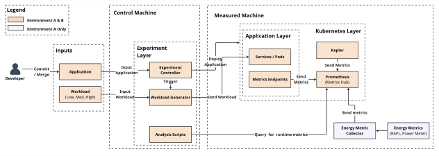

# EnergyBenchMS Controller

This repository orchestrates repeatable energy/performance experiments for cloud-native applications, with support for:

- single-run and repeated-run execution
- multi-level workloads and saturation experiments
- Prometheus/Kepler attribution collection
- optional physical power meter sampling
- HTML dashboards and notebook-based analysis

## System Architecture

Architecture preview:



High-resolution source:

- [docs/system-architecture-v5.pdf](docs/system-architecture-v5.pdf)

## Repository Rundown

- `scripts/`: experiment orchestration, querying, summarization, dashboard generation
- `apps/`: benchmark applications and versioned variants (git submodules)
- `workloads/`: workload YAML definitions (including multi-level and saturation settings)
- `app-configs/`: manifest/namespace/exclusion config for non-standard app layouts
- `runs/`: generated experiment run folders
- `final-runs/`: curated and aggregated analysis outputs
- `visualizations/`: notebooks and figure-generation artifacts
- `docs/`: architecture and machine setup documentation

## Conference Reproducibility Quickstart

### 1) Environment setup

Create/activate your Python environment and install the required dependencies:

```bash
pip install -r requirements.txt
```

To set up the measured machine from scratch, follow this guide:

- [docs/Measured Machine Setup.md](docs/Measured%20Machine%20Setup.md)

Initialize submodules after cloning:

```bash
git submodule update --init --recursive
```

### 2) Preflight metrics coverage check (recommended)

Collect Prometheus query snapshots:

```bash
scripts/collect_prometheus_queries.sh \
  http://192.168.0.100:9090 \
  <START_EPOCH_SECONDS> \
  <END_EPOCH_SECONDS> \
  prom_queries
```

Validate Kepler/kube label coverage:

```bash
python scripts/preflight_prometheus_check.py --queries-dir prom_queries
```

### 3) Run a batch experiment (main pipeline)

```bash
python scripts/run_pipeline.py \
  --count 3 \
  --app apps/simple-web \
  --workload workloads/simple-web.yaml \
  --locustfile apps/simple-web/locustfile.py \
  --prom-url http://192.168.0.100:9090 \
  --energy-source auto \
  --baseline-seconds 20 \
  --cooldown-seconds 60
```

Optional physical meter integration:

```bash
python scripts/run_pipeline.py \
  --count 3 \
  --app apps/simple-web \
  --workload workloads/simple-web.yaml \
  --locustfile apps/simple-web/locustfile.py \
  --prom-url http://192.168.0.100:9090 \
  --energy-source auto \
  --baseline-seconds 20 \
  --cooldown-seconds 60 \
  --power-meter-url http://192.168.0.105/rpc/Switch.GetStatus?id=0 \
  --power-meter-interval-seconds 1 \
  --power-meter-request-timeout-seconds 5
```

### 4) Generated outputs

Each batch creates a timestamped directory under `runs/` containing:

- per-run folders with metadata, summaries, and raw artifacts
- `runs_comparison.html` dashboard
- saturation files when saturation mode is enabled (`saturation_plan.json`, `calibration_summary.csv`, `saturation_summary.json`)

## Single Experiment Run

```bash
python scripts/run_experiment.py \
  --app apps/simple-web \
  --workload workloads/simple-web.yaml \
  --locustfile apps/simple-web/locustfile.py
```

Useful optional flags:

- `--ramp-exclusion-seconds`
- `--baseline-seconds`
- `--max-error-rate`
- `--sut-ready-timeout-seconds`
- `--prom-url` (Prometheus-aligned timestamps)

## Per-run Post-processing

Query Prometheus for an existing run:

```bash
python scripts/query_prometheus.py \
  --run-dir runs/<run_dir> \
  --prom-url http://192.168.0.100:9090 \
  --energy-source auto
```

Supported `--energy-source` values:

- `auto` (preferred)
- `joules`
- `bpf_cpu_time`
- `bpf_block_irq`

Summarize a run:

```bash
python scripts/summarise_run.py --run-dir runs/<run_dir>
```

Build or refresh a dashboard:

```bash
python scripts/visualise_runs.py --runs-dir runs --output runs_comparison.html
```

## Workload Levels and Saturation

Define named levels in workload YAML:

```yaml
workload_levels:
  - low: 20
  - medium: 40
  - high: 60
```

Run saturation mode:

```bash
python scripts/run_pipeline.py \
  --saturation-enabled \
  --app apps/simple-web \
  --workload workloads/simple-web.yaml \
  --locustfile apps/simple-web/locustfile.py \
  --prom-url http://192.168.0.100:9090 \
  --energy-source auto
```

## App Configuration and Deployment Resolution

If an app does not use a simple `apps/<name>/deployment.yaml` style layout, add config in one of these locations (priority order):

1. `apps/<app>/pipeline_app.yaml`
2. `app-configs/<app-name>.yaml`
3. `app-configs/<relative-app-path>/pipeline_app.yaml`

Example:

```yaml
manifest_path: deploy/kubernetes/manifests
namespace: sock-shop
exclude_resource_patterns:
  - "(^|/)prometheus($|[-/])"
  - "(^|/)kepler($|[-/])"
  - "(^|/)load-?test($|[-/])"
```

Equivalent one-off CLI overrides:

- `--manifest-path`
- `--namespace`
- `--exclude-resource-pattern` (repeatable)
- `--exclude-kind` (repeatable)

## SUT Lifecycle Helper

Bring the stack up/down without running workload traffic:

```bash
python scripts/manage_sut.py up --app apps/simple-web

python scripts/manage_sut.py down \
  --app apps/simple-web \
  --sleep-seconds 30
```

## Submodule Management

Add a new app as submodule:

```bash
git submodule add git@github.com:open-telemetry/opentelemetry-demo.git apps/oteldemo
```

Example: add a versioned submodule and pin a release:

```bash
git submodule add --name apps/oteldemo-2.0.0 git@github.com:open-telemetry/opentelemetry-demo.git apps/oteldemo-2.0.0
git -C apps/oteldemo-2.0.0 fetch --tags
git -C apps/oteldemo-2.0.0 checkout 2.0.0
```

Sync submodules on another machine:

```bash
git submodule update --init --recursive
```

## Notes for Artifact Reviewers

- Keep controller and Prometheus clocks aligned to avoid query-window skew.
- For large applications, increase `--sut-ready-timeout-seconds` above the default 300 seconds.
- Physical meter sampling is additive and does not replace Prometheus/Kepler attribution.

## Archived Run Bundle

The archive [final-runs.zip](final-runs.zip) contains the full curated experimental dataset used for analysis.

It includes:

- Main experiment runs: 360 total runs
- Coverage for 4 applications x 3 releases x 3 workload levels x 5 iterations x 2 environments
- OTel Demo context runs: 3 releases x 20 iterations
- Saturation runs for each application

The extracted structure under [final-runs](final-runs) also includes aggregated result tables and diagnostics used by the notebooks and figure generation.
